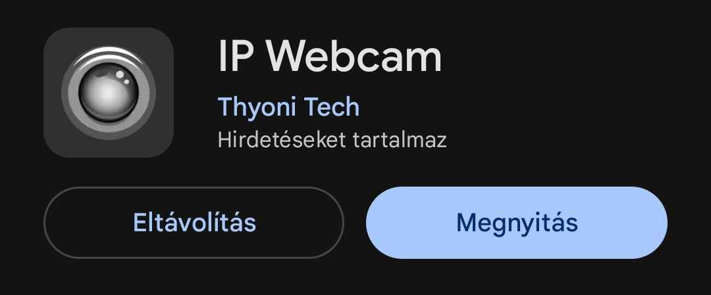

# virtual_mouse
This is a university project for our "advanced computer vision" class.

# Requirements
### Python packages
opencv-python \
numpy \
mediapipe \
pyautogui \
screeninfo

### Android
Ip webcam from play store

# Usage
1. Start ip webcam app on your phone
2. Start the webcam server on the phone
3. Make sure the pc and the phone are on the same network
4. Write the ip as a program argument between ""-s
5. Run main.py with the ip as the first argument